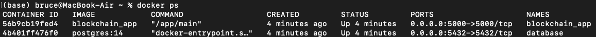
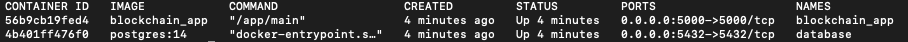
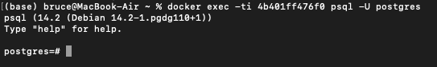

# Bitcoin Blockchain API

A simple REST API developed with Go, Gin, and GORM to mimic operations that may occur on a Bitcoin Blockchain. This includes mining blocks, creating address (or wallets) and creating and viewing transactions. 

The blockchain implementation heavily relies on this blog post: https://jeiwan.net/posts/building-blockchain-in-go-part-1/

#### How to run the app
In the root directory containing the `docker-compose.yml` file, run:

1. `docker-compose down`
2. `docker-compose -f docker-compose.yml up`

After running the above commands, you should see that two containers get spun up with `docker ps`:

 

The service will be running on port 5000 by default. To test that the API is healthy, make a request to `GET localhost:5000/bitcoin`. You should see the following response:

`"Blockchain healthy"`

Now, you should be able to make requests to the API. Refer to the [swagger](docs/swagger.yaml) for more information on the available endpoints.

Alternatively, if you have [docker hub](https://hub.docker.com/), you may pull the image from docker and run it as a container with the following commands

1. `docker pull brucetieu/blockchain:latest`
2. `docker run brucetieu/blockchain`


#### How to access the Postgres CLI (psql) inside of the running Postgres container
In this project we use a postgres container for data persistence. In another terminal, run the following commands:

1. ```docker ps```
   
     

2. ```docker exec -ti CONTAINER_ID psql -U YOUR_POSTGRES_USERNAME```
     

The data will be stored in the `blockchain` database. Refer to the [psql docs](https://www.postgresql.org/docs/current/app-psql.html) for all available commands.


