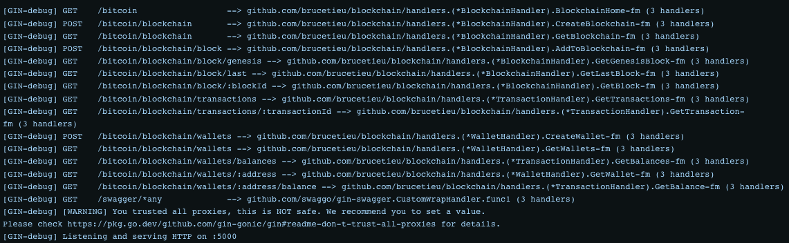

# Bitcoin Blockchain API

A simple REST API developed with Go, Gin, PostgreSQL, and GORM to mimic operations that may occur on a Bitcoin Blockchain. This includes mining blocks, creating address (or wallets) and creating and viewing transactions. 

The blockchain implementation heavily relies on this blog post: https://jeiwan.net/posts/building-blockchain-in-go-part-1/

---

### How to run the app
In the root directory containing the `docker-compose.yml` file, run:

1. `docker-compose down`
2. `docker-compose -f docker-compose.yml up`

To recreate containers, run `docker-compose up --build`

**Note**: You may need to clear any old postgres containers or volumes. To start fresh, you can run

`docker stop $(docker ps -qa) && docker system prune -af --volumes`

Then run command 2) above.

**The .env file**
You may modify the following environment variables to your choosing:

 - `POSTGRES_HOST_NAME` - The hostname or container name for the running postgres server. 
 - `POSTGRES_USER` - The username to use for the connection.
 - `POSTGRES_PASSWORD` - The password to use for the connection.
 - `POSTGRES_DB` - The database to use once connected.

By default,

 - `POSTGRES_HOST_NAME=database` 
 - `POSTGRES_USER=postgres` 
 - `POSTGRES_PASSWORD=pass` 
 - `POSTGRES_DB=blockchain`


---

After running the above commands, you should see that two containers get spun up with `docker ps`:

 

This is a sample of the container log for the `blockchain_app` container:

 


Alternatively, if you have [docker hub](https://hub.docker.com/), you may pull the image from docker and run it as a container. The image name is `brucetieu/blockchain:latest`, and you can run `docker pull brucetieu/blockchain:latest` to pull the image.

Additionally, you will need to create a network and attach a postgresql container so that the image you will run can communicate with it. Here are the commands to do that.

1. Create the network

`docker network create <your-network-name>`

2. Start a posgresql container and attach it to the network

```
docker run -d \
> --network <your-network-name> --network-alias <your-network-alias> \
> -v <your-volume-name>:/var/lib/postgresql/data \
> -e POSTGRES_USER=<your-postgres-user> \
> -e POSTGRES_PASSWORD=<your-postgres-pass> \
> -e POSTGRES_DB=<your-postgres-db> \
> --name <container-name> \ 
> postgres:14
```


3. Run the app with postgresql. The blockchain app supports the setting of several environment variables to specify postgres connection settings. They are:

    - `POSTGRES_HOST_NAME` - The hostname for the running postgres server. This is the name of the postgres container that was created in step 2.
    - `POSTGRES_USER` - The username to use for the connection.
    - `POSTGRES_PASSWORD` - The password to use for the connection.
    - `POSTGRES_DB` - The database to use once connected.


```
docker run -dp 5000:5000 \
> --network <your-network-name> \
> -e POSTGRES_HOST_NAME=<postgres-container-name> \
> -e POSTGRES_USER=<your-postgres-user> \
> -e POSTGRES_PASSWORD=<your-postgres-pass> \
> -e POSTGRES_DB=<your-postgres-db> \
> brucetieu/blockchain:latest
```

The service will be running on port 5000 by default. To test that the API is healthy, make a request to `GET localhost:5000/bitcoin`. You should see the following response:

`"Blockchain healthy"`

Now, you should be able to make requests to the API. Refer to the [swagger](docs/swagger.yaml) for more information on the available endpoints, or visit `localhost:5000/swagger/index.html` once the service is running.

---

### How to access the Postgres CLI (psql) inside of the running Postgres container
In this project we use a postgres container for data persistence. In another terminal, run the following commands to get inside that container:

1. ```docker ps```
   
     

    We will need the container name running postgres, e.g. `database` in the photo.

<br>

2. Connect to postgres in the running container with ```docker exec -it <NAME_OF_RUNNING_POSTGRES_CONTAINER> psql -U <POSTGRES_USER> <POSTGRES_DB>```
     

    `POSTGRES_USER` and `POSTGRES_DB` are optional environment variables you can set. By default, these values are `postgres` and `blockchain` respectively. 

    <br>

    The data will be stored in the `blockchain` database, or the database name you specified via the `POSTGRES_DB` environment variable. Refer to the [psql docs](https://www.postgresql.org/docs/current/app-psql.html) for all available `psql` commands.


